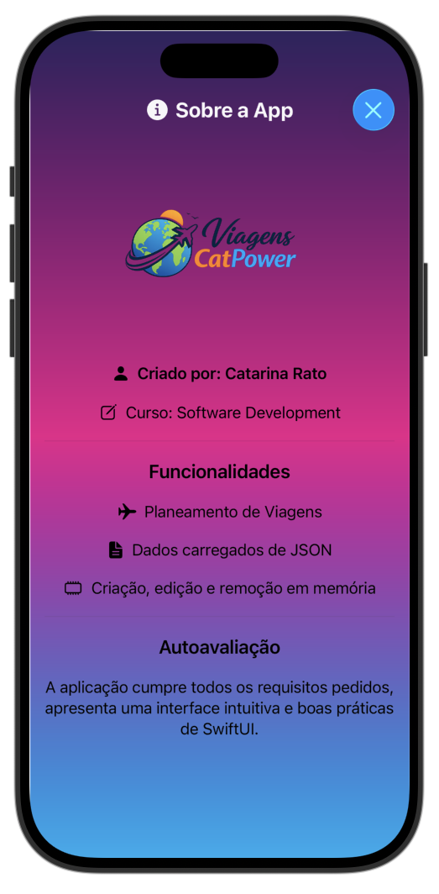

# ✈️ Viagens CatPower

**Viagens CatPower** é uma aplicação iOS desenvolvida em **Swift** e **SwiftUI** que permite ao utilizador planear e gerir viagens de forma simples, visual e organizada.

A aplicação permite visualizar viagens planeadas, adicionar novas viagens, editar viagens existentes e remover viagens da lista. Os dados iniciais são carregados a partir de um ficheiro **JSON**, sendo depois manipulados **em memória** durante a execução da aplicação.

Este projeto foi desenvolvido no âmbito da unidade curricular de **iOS Development**.

---

# 📱 Screenshots

### Lista de Viagens

### Criar Nova Viagem

### Editar Viagem

### Sobre a Aplicação

---

# 📋 Funcionalidades

- Visualização de uma lista de viagens
- Criação de novas viagens
- Edição de viagens existentes
- Remoção individual de viagens
- Remoção de todas as viagens da lista
- Seleção de imagem representativa da viagem
- Seleção do tipo de viagem (Lazer, Trabalho, Família, Aventura ou Cultural)
- Vista **About** com informação sobre a aplicação

---

# 🗂 Estrutura dos Dados

Cada viagem contém:

- `id`
- `nome`
- `destino`
- `periodo`
- `tipo`
- `descricao`
- `imagem`

Os dados são carregados a partir de um ficheiro **JSON** incluído no bundle da aplicação.

---

# 🏗 Arquitetura

A aplicação segue o padrão **MVVM (Model–View–ViewModel)**.

### Model
- `Trip.swift`

### ViewModel
- `TripViewModel.swift`

Principais métodos:
- `loadTripsFromJSON()`
- `addTrip()`
- `updateTrip()`
- `deleteTrip()`
- `deleteAllTrips()`

### Views
- `TripListView.swift`
- `TripRowView.swift`
- `AddTripView.swift`
- `EditTripView.swift`
- `AboutView.swift`

---

# 🛠 Tecnologias Utilizadas

- Swift
- SwiftUI
- JSON
- Xcode
- SF Symbols

---

# 👩‍💻 Autor

**Catarina Rato**

Projeto desenvolvido para fins académicos.
